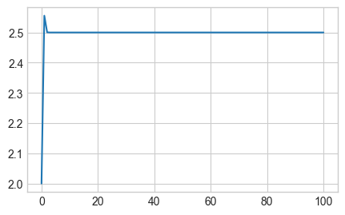
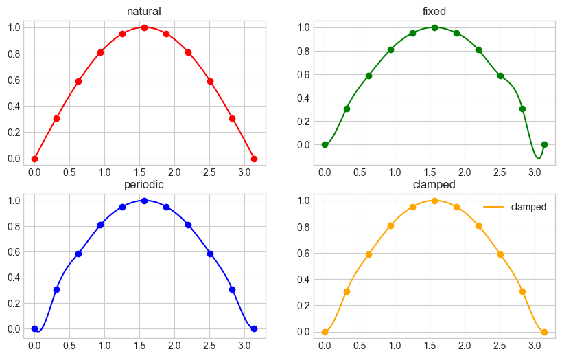
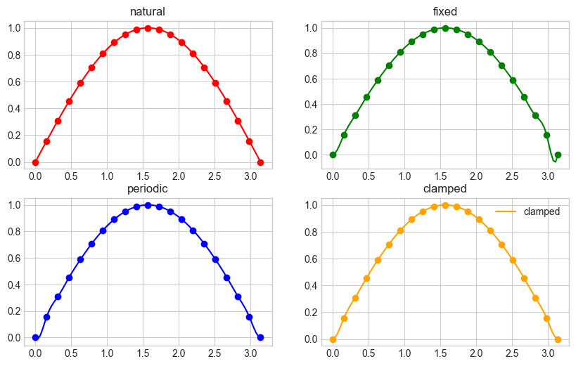

## 第一章作业上机实验

### 求方程 $x^2 + (\alpha - \beta) x + 10^9 = 0$ 的根。其中 $\alpha = -10^9, \beta = -1$，讨论如何设计计算格式才能有效减少误差，提高运算精度。

由于待求解方程组为一元二次方程组，因此可直接使用求根公式 $$x = \cfrac{-b \pm \sqrt{b^2 - 4ac}}{2a}$$ 求解。在题设背景中，$a = 1, b = \alpha + \beta = -10^9 - 1, c = 10^9$。

注意到 $|b| = \sqrt{b^2 - 4ac}$，且 $b < 0$，因此应用改进形式，使用分子有理化：
$$
x = \cfrac{-2c}{b \pm \sqrt{b^2 - 4ac}}
$$

解得 $x_1 = 10^9$，$x_2 = 1$。Python 求解代码如下：

```python
alpha, beta = -1e9, -1
a, b, c = 1, alpha + beta, 1e9

x1, x2 = (-2 * c) / (b + (b ** 2 - 4 * a * c) ** 0.5) \
       , (-2 * c) / (b - (b ** 2 - 4 * a * c) ** 0.5)

print(x1, x2)
```

### > 以计算 $x^{31}$ 为例，讨论如何设计计算格式才能减少计算次数。

注意到例如 $31 = 2^0 + 2^1 + 2^2 + 2^3 + 2^4$，任何正整数均有唯一一个二进制拆分方式。

令 $f_i = x^{2^i}$，注意到 $f_i = f_{i - 1} \times f_{i - 1}$。因此可以在将指数做二进制分解的同时，通过迭代方式计算 $f_i$。从而在 $\mathcal{O}(\log x)$ 时间复杂度内计算 $a^x$（$a = \text{const}$），远优于朴素乘法的 $\mathcal{O}(x)$。

例如，对 $x^{31}$，可分解为 $x^{2^0} \times x^{2^1} \times x^{2^2} \times x^{2^3} \times x^{2^4}$ 的形式。

假设 $x = 42$，求得 $x^31 = 209280132851277227501988209234026802122409700753408$。Python 求解代码如下：

```python
def fpow(x: float, y: int) -> float:
    res: float = 1
    while y:
        if y & 1:
            res *= x
        x *= x
        y >>= 1
    return res

x, y = 42, 31
print(fpow(x, y))
```

## 第二章作业上机实验

### 求方程 $2x^2 + x - 15 = 0$ 的正根（$x* = 2.5$）近似值。

提供的三种方法分别是两种不动点迭代方法和牛顿法。

$x_{k+1} = 15 - x_k^2$ 不收敛，因数值过大无法计算。

$x_{k + 1} = \cfrac{15}{2x_k + 1}$ 结果如图：


$x_{k + 1} = x_k - \cfrac{2x_k^2 + x_k - 15}{4x_k + 1}$ 结果如图：



**收敛性分析**


#### 1. $x_{k+1} = 15 - x_k^2$
这个公式基于将方程变形为：
$ 2x^2 + x - 15 = 0 \implies x = 15 - x^2 $

**稳定性和收敛性分析：**
- 在根 $x^* = 2.5$ 附近，设 $x_k = x^* + \epsilon_k$，其中 $\epsilon_k$ 是小的偏差。
- 代入迭代公式：
  $ x_{k+1} = 15 - (x^* + \epsilon_k)^2 $
  $ x_{k+1} = 15 - (2.5 + \epsilon_k)^2 $
  $ x_{k+1} = 15 - (6.25 + 5\epsilon_k + \epsilon_k^2) $
  $ x_{k+1} = 8.75 - 5\epsilon_k - \epsilon_k^2 $

- 对于小的$\epsilon_k$，忽略$\epsilon_k^2$项：
  $ x_{k+1} \approx 8.75 - 5\epsilon_k $
  这里我们看到，误差$\epsilon_k$被放大了5倍，所以这个迭代公式是不稳定的并且是发散的。

#### 2. $x_{k+1} = \frac{15}{2x_k + 1}$
这个公式基于将方程变形为：
$ 2x^2 + x - 15 = 0 \implies x = \frac{15}{2x + 1} $

**稳定性和收敛性分析：**
- 在根 $x^* = 2.5$ 附近，设 $x_k = x^* + \epsilon_k$，其中 $\epsilon_k$ 是小的偏差。
- 代入迭代公式：
  $ x_{k+1} = \frac{15}{2(x^* + \epsilon_k) + 1} $
  $ x_{k+1} = \frac{15}{2(2.5 + \epsilon_k) + 1} $
  $ x_{k+1} = \frac{15}{6 + 2\epsilon_k} $
  $ x_{k+1} \approx \frac{15}{6(1 + \frac{2\epsilon_k}{6})} $
  $ x_{k+1} \approx \frac{15}{6} \cdot \left(1 - \frac{2\epsilon_k}{6}\right) $
  $ x_{k+1} \approx 2.5 \cdot \left(1 - \frac{\epsilon_k}{3}\right) $
  $ x_{k+1} \approx 2.5 - \frac{2.5\epsilon_k}{3} $
  $ x_{k+1} \approx 2.5 - 0.833\epsilon_k $

- 这里误差$\epsilon_k$被缩小了约0.833倍，所以这个迭代公式是收敛的，但收敛速度较慢。

#### 3. $x_{k+1} = x_k - \frac{2x_k^2 + x_k - 15}{4x_k + 1}$
这个公式基于牛顿法：
$ f(x) = 2x^2 + x - 15 $
$ f'(x) = 4x + 1 $
$ x_{k+1} = x_k - \frac{f(x_k)}{f'(x_k)} = x_k - \frac{2x_k^2 + x_k - 15}{4x_k + 1} $

**稳定性和收敛性分析：**
- 在根 $x^* = 2.5$ 附近，设 $x_k = x^* + \epsilon_k$，其中 $\epsilon_k$ 是小的偏差。
- 牛顿法通常具有二阶收敛速度：
  $ x_{k+1} = x_k - \frac{f(x^* + \epsilon_k)}{f'(x^* + \epsilon_k)} $

  由于牛顿法的二阶收敛性质：
  $ \epsilon_{k+1} \approx C\epsilon_k^2 $
  其中C是一个常数。

- 因此，误差的平方使得收敛速度非常快。这表明这个迭代公式在根附近收敛速度非常快，通常是最有效的方法。

#### 总结
- $x_{k+1} = 15 - x_k^2$：不稳定，发散。
- $x_{k+1} = \frac{15}{2x_k + 1}$：稳定，收敛速度较慢。
- $x_{k+1} = x_k - \frac{2x_k^2 + x_k - 15}{4x_k + 1}$：稳定，收敛速度快（二阶收敛）。

### 证明方程 $2 - 3x - \sin x = 0$ 在 $(0, 1)$ 内有且仅有一个实根。使用二分法求误差不大于 $0.0005$ 的根，及需要的迭代次数。

令 $f(x) = 2 - 3x - \sin x$，有 $f'(x) = -3 - \cos x < 0$，因此其在定义域内单调递减。又 $f(0) = 2$，$f(1) = -1 - \sin 1 < 0$，故 $f(x) = 0$ 在 $(0, 1)$ 内只有一个实根。

在使用二分法迭代约 $11$ 次后，解得 $x = 0.50537109375$，此时 $f(x) = 0.0016466850065690042$，且误差在 $0.0005$ 以内。

Python 代码如下：

```python
def f(x: float) -> float:
    return 2 - 3 * x - math.sin(x)

TOL = 0.0005
l, r = 0, 1
cnt = 0
while (r - l) > TOL:
    cnt += 1
    x = (l + r) / 2
    if f(x) > 0:
        l = x
    else:
        r = x

print(x, cnt, f(x))
```

### 利用牛顿法求解方程
> $$ \cfrac 12 + \cfrac 14 x^2 - x \sin x - \cfrac 12 \cos 2x = 0$$
> 分别取 $x_0 = \cfrac \pi 2, 5 \pi, 10 \pi$ 使得精度不小于 $10^{-5}$。比较初值对计算结果的影响。

结果如下，其中 `res` 代表最终的结果，`cnt` 代表迭代次数：

```plain
x0 = 1.5707963267948966, res = 1.8954884189769137, cnt = 15
x0 = 15.707963267948966, res = 1.8954890013731998, cnt = 19
x0 = 31.41592653589793, 不收敛
```
初值对结果的影响是，虽然最终结果是相同的，但是迭代次数可能会有所不同。如果初值过大，可能会导致迭代次数过多，甚至不收敛。

### 已知 $f(x) = 5x - e^x$ 在 $(0, 1)$ 之间有一个实根，试分别利用二分法、牛顿法、割线法、错位法设计相关的计算格式，并编程求解。精确到四位小数。

在二分法中，取二分点为 $x = \frac{l + r}{2}$，在牛顿法中，取初始点为 $x_0 = 0.5$，在割线法中，取初始点为 $x_0 = 0, x_1 = 1$，在错位法中，取初始点为 $x_0 = 0, x_1 = 1$，结果如下：

```plain
bisection: res = 0.99993896484375, cnt = 14
newton: res = 0.25917110166149104, cnt = 3
secant: res = 0.2591712288816814, cnt = 4
regula_falsi: res = 0.25917408510579704, cnt = 4
```

Python 代码如下：

```python
def f(x: float) -> float:
    return 5 * x - math.exp(x)

def df(x: float) -> float:
    return 5 - math.exp(x)

def bisection(l: float, r: float) -> float:
    TOL = 1e-4
    cnt = 0
    while (r - l) > TOL:
        cnt += 1
        x = (l + r) / 2
        if f(x) > 0:
            l = x
        else:
            r = x
    return x, cnt

def newton(x0: float) -> float:
    TOL = 1e-4
    cnt = 0
    while True:
        cnt += 1
        x = x0 - f(x0) / df(x0)
        if abs(x - x0) < TOL:
            break
        x0 = x
    return x, cnt

def secant(x0: float, x1: float) -> float:
    TOL = 1e-4
    cnt = 0
    while True:
        cnt += 1
        x = x1 - f(x1) * (x1 - x0) / (f(x1) - f(x0))
        if abs(x - x1) < TOL:
            break
        x0, x1 = x1, x
    return x, cnt

def regula_falsi(x0: float, x1: float) -> float:
    TOL = 1e-4
    cnt = 0
    while True:
        cnt += 1
        x = x1 - f(x1) * (x1 - x0) / (f(x1) - f(x0))
        if abs(x - x1) < TOL:
            break
        if f(x) * f(x1) < 0:
            x0 = x
        else:
            x1 = x
    return x, cnt

l, r = 0, 1
res, cnt = bisection(l, r)
print(f'bisection: res = {res}, cnt = {cnt}')

x0 = 0.5
res, cnt = newton(x0)
print(f'newton: res = {res}, cnt = {cnt}')

x0, x1 = 0, 1
res, cnt = secant(x0, x1)
print(f'secant: res = {res}, cnt = {cnt}')

x0, x1 = 0, 1
res, cnt = regula_falsi(x0, x1)
print(f'regula_falsi: res = {res}, cnt = {cnt}')
```

## 第三章作业上机实验

### 基于不同边界条件的样条函数计算公式推导：自然边界、固定边界、周期边界、强制第一个子区间和第二个子区间样条多项式的三阶导数相同，倒数第二个子区间和最后一个子区间的三次样条函数的三阶导数相等。

#### 自然边界

在自然边界条件下，要求在端点处的二阶导数为零。这意味着样条函数的曲率在边界上为零，常用于边界不受约束的情况。

对于一个在节点 $(x_0, y_0), (x_1, y_1), \cdots, (x_n, y_n)$ 上的三次样条函数 $S(x) $，可以表示为：

$ S_i(x) = a_i + b_i(x - x_i) + c_i(x - x_i)^2 + d_i(x - x_i)^3 ~ \text{for} \; x \in [x_i, x_{i+1}] $

自然边界条件：$ S''(x_0) = 0, S''(x_n) = 0 $

##### 推导

对于自然边界条件，需要解以下线性方程组：

$ h_i = x_{i+1} - x_i$，$\Delta y_i = y_{i+1} - y_i $

构建样条函数 $ S_i(x) $ 的系统：

$ S_i''(x_{i+1}) = S_{i+1}''(x_{i+1})$，$\int_{x_i}^{x_{i+1}} S_i''(x) \, \text{ d} x = \Delta y_i - \frac{h_i}{6}(c_i + 2c_{i+1})$，$S''(x_0) = 0$，$S''(x_n) = 0 $

最终会得到一个三对角矩阵的线性方程组，可以用来解 $ c_i $，然后反过来求 $ a_i $，$ b_i $ 和 $ d_i $。

#### 固定边界

在固定边界条件下，要求在端点处的一阶导数（斜率）给定。设端点处的斜率为 $ f'(x_0) $ 和 $ f'(x_n) $。

固定边界条件：$ S'(x_0) = f'(x_0), S'(x_n) = f'(x_n) $

##### 推导

对于固定边界条件，构建样条函数 $ S_i(x) $ 的系统：

$ S_i(x_i) = y_i$，$S_i(x_{i+1}) = y_{i+1}$，$S_i'(x_i) = f'(x_i)$，$S_i'(x_{i+1}) = f'(x_{i+1}) $

#### 周期边界

周期边界条件用于周期性数据，这时要求样条函数及其导数在首尾相接处一致。

周期边界条件：$ S(x_0) = S(x_n)$，$S'(x_0) = S'(x_n)$，$S''(x_0) = S''(x_n) $

##### 推导

对于周期边界条件，需要解以下线性方程组：

$ S_0(x_0) = S_{n-1}(x_n)$，$S_0'(x_0) = S_{n-1}'(x_n)$，$S_0''(x_0) = S_{n-1}''(x_n) $

并结合内部节点的连续性条件来形成完整的方程组。

#### 第一个子区间和第二个子区间样条多项式的三阶导数相等，倒数第二个子区间和最后一个子区间的三次样条函数的三阶导数相等

$ S'''_0(x) = S'''_1(x) ~ \text{for} \; x \in [x_0, x_1]$，$S'''_{n-1}(x) = S'''_n(x) ~ \text{for} \; x \in [x_{n-1}, x_n] $

### 以 $y = \sin(x)$ 为例，在 $[0,π]$ 区间内生成 $11$ 个、$21$ 个数据点，设计算法或程序，用上述 $4$ 个边界条件，分别计算其样条插值，并作图比较，分析其差异性。



上图是 $y = \sin(x)$ 在采样点数量为 $11$ 的情况下，四个边界条件的样条插值图像。注意到差异主要集中在两个端点，自然边界和固定边界的样条插值在端点处的导数为 $0$，而周期边界和强制边界的样条插值在端点处的导数不为 $0$，因此在端点处的样条插值图像有明显差异。



上图是 $y = \sin(x)$ 在采样点数量为 $21$ 的情况下，四个边界条件的样条插值图像。

### 求一个次数不高于 $4$ 次的多项式，满足某个条件。

#### 1. $f(1) = f'(1) = 0$，$f(2) = f'(2) = 0$，$f(3) = 1$

构造多项式 $$f(x) = a(x - 1)^2 (x - 2)^2.$$

该多项式天然满足 $f(1) = f'(1) = 0$，$f(2) = f'(2) = 0$，现令 $f(3) = 1$。

$$f(3) = 4a = 1 \Rightarrow a = \cfrac 14$$

因此有 $$f(x) = \cfrac 14(x - 1)^2 (x - 2)^2$$ 满足上述特征。Python 验证代码如下：

```python
def f(x: float) -> float:
    return 0.25 * (x - 1) ** 2 * (x - 2) ** 2

def df(x: float) -> float:
    return 0.5 * (x - 1) * (x - 2) * (2 * x - 3)

print(f'f(1) = {f(1)}, f\'(1) = {df(1)}, f(2) = {f(2)}, f\'(2) = {df(2)}, f(3) = {f(3)}')
```

结果为 `f(1) = 0.0, f'(1) = 0.0, f(2) = 0.0, f'(2) = 0.0, f(3) = 1.0`。

#### 2. $f(0) = f'(0) = 0$，$f(1) = f'(1) = 1$，$f(2) = 1$

令 $f(x) = ax^4 + bx^3 + cx^2 + \text{ d} x + e$。由 $f(0) = f'(0) = 0$，有 $d = e = 0$。故 $f(x) = ax^4 + bx^3 + cx^2$。

接下来构造如下方程：

- $f(1) = 1$：$a + b + c = 1$；
- $f'(1) = 1$：$4a + 3b + 2c = 1$；
- $f'(2) = 1$：$16a + 8b + 4c = 1$。

求解线性方程组，得 $a = 0.25, b = -1.5, c = 2.25$。故有 $$ f(x) = 0.25 x^4 - 1.5x^3 + 2.25x^2$$

```python
A = np.array([[1, 1, 1], [4, 3, 2], [16, 8, 4]])
B = np.array([1, 1, 1])
X = np.linalg.solve(A, B)

print(X)

def f(x: float) -> float:
    return X[0] * x ** 4 + X[1] * x ** 3 + X[2] * x ** 2

def df(x: float) -> float:
    return 4 * X[0] * x ** 3 + 3 * X[1] * x ** 2 + 2 * X[2] * x

print(f'f(0) = {f(0)}, f\'(0) = {df(0)}, f(1) = {f(1)}, f\'(1) = {df(1)}, f(2) = {f(2)}')
```

验证结果得 `f(0) = 0.0, f'(0) = 0.0, f(1) = 1.0, f'(1) = 1.0, f(2) = 1.0`。

### 怎么选定步长 $h$，才能使得分段线性插值函数和 $\sin x$ 的误差小于 $\cfrac 12 \times 10^{-6}$。

对于分段线性插值，在节点之间的最大误差可以由以下公式近似：$$ |E(x)| \leq \frac{M}{8} h^2 $$ 其中 $M = \max \sin'' x$。因为 $\sin x$ 的二阶导数是 $-\sin x$，它的最大绝对值为 $1$。因此 $ M = 1$。

所以误差公式简化为：$$ |E(x)| \leq \frac{h^2}{8} $$

希望这个误差小于 $\cfrac{1}{2} \times 10^{-6}$，那么有 $$ \frac{h^2}{8} \leq \frac{1}{2} \times 10^{-6} \Rightarrow h^2 \leq 4 \times 10^{-6} \Rightarrow h \leq 2 \times 10^{-3} $$

因此需要选择步长 $ h \leq 2 \times 10^{-3} $。

### 求满足下列条件的三次样条插值函数 $s(x)$：$s(1) = s(2) = 1, s(3) = 2, s'(1) = 0, s'(3) = 3$。

根据定义，$$ s(x) = \begin{cases}
s_1(x), & 1 \leq x \leq 2 \\
s_2(x), & 2 < x \leq 3
\end{cases} $$ 其中 $$ s_1(x) = a_1 + b_1(x - 1) + c_1(x - 1)^2 + d_1(x - 1)^3 \\
s_2(x) = a_2 + b_2(x - 2) + c_2(x - 2)^2 + d_2(x - 2)^3 $$

基于题意和三次样条插值函数的连续特征，有以下条件：

1. $ s(1) = 1 $
2. $ s(2) = 1 $
3. $ s(3) = 2 $
4. $ s'(1) = 0 $
5. $ s'(3) = 3 $
6. $ s_1(2) = s_2(2) $
7. $ s_1'(2) = s_2'(2) $

根据条件，可以推出以下线性方程组：

1. $ s_1(1) = a_1 = 1 $
2. $ s_1(2) = a_1 + b_1(1) + c_1(1)^2 + d_1(1)^3 = 1 $
3. $ s_2(2) = a_2 = 1 $
4. $ s_2(3) = a_2 + b_2(1) + c_2(1)^2 + d_2(1)^3 = 2 $
5. $ s_1'(1) = b_1 = 0 $
6. $ s_2'(3) = b_2 + 2c_2(1) + 3d_2(1)^2 = 3 $
7. $ s_1'(2) = b_1 + 2c_1(1) + 3d_1(1)^2 = s_2'(2) = b_2 $

求解得到 $$a_1 = 1.0, a_2 = 0.0, a_3 = 1.0, a_4 = -1.0, b_1 = 1.0, b_2 = -1.0, b_3 = 2.0, b_4 = -0.0$$ 故最终有
$$
s(x) = \begin{cases}
-(x - 1)^3 + (x - 1)^2 + 1, & 1 \leq x \leq 2 \\
2(x - 2)^2 - (x - 2) + 1, & 2 < x \leq 3
\end{cases}
$$

这是满足所有条件的三次样条插值函数。Python 求解、验证代码如下：

```python
A = np.array([[1, 0, 0, 0, 0, 0, 0, 0], \
              [1, 1, 1, 1, 0, 0, 0, 0], \
              [0, 0, 0, 0, 1, 0, 0, 0], \
              [0, 0, 0, 0, 1, 1, 1, 1], \
              [0, 1, 0, 0, 0, 0, 0, 0], \
              [0, 0, 0, 0, 0, 1, 2, 3], \
              [0, 1, 2, 3, 0, -1, 0, 0], \
              [0, 0, 1, 0, 0, 0, 0, 0]])
B = np.array([1, 1, 1, 2, 0, 3, 0, 1])
X = np.linalg.solve(A, B)

def s(x: float) -> float:
    if x < 2:
        return X[0] + X[1] * (x - 1) + X[2] * (x - 1) ** 2 + X[3] * (x - 1) ** 3
    else:
        return X[4] + X[5] * (x - 2) + X[6] * (x - 2) ** 2 + X[7] * (x - 2) ** 3

def ds(x: float) -> float:
    if x < 2:
        return X[1] + 2 * X[2] * (x - 1) + 3 * X[3] * (x - 1) ** 2
    else:
        return X[5] + 2 * X[6] * (x - 2) + 3 * X[7] * (x - 2) ** 2

print(f's(1) = {s(1)}, s(2) = {s(2)}, s(3) = {s(3)}, s\'(1) = {ds(1)}, s\'(3) = {ds(3)}')
```

输出结果为 `s(1) = 1.0, s(2) = 1.0, s(3) = 2.0, s'(1) = 0.0, s'(3) = 3.0`。

## 第四章作业上机实验
### 推导复合梯形公式及其误差估计；推导基于误差控制的逐次半积分梯形公式及其误差估计。

#### 梯形公式推导

假设需要计算 $\int_a^b f(x) \text{ d} x$。

将 $[a, b]$ 分为 $n$ 个小区间，每个小区间宽度 $h = \cfrac{b - a}{n}$。对每个小区间使用梯形法则。设 $x_j = a + j \cdot h$。

梯形法则：$$ \int _a^b f(x) \text{ d} x = \cfrac h2 [f(x_0) + f(x_1)] - \cfrac{h^3}{12} f''(\xi) $$

在所有子区间上应用梯形法则，有 $$ \int _a^b f(x) \text{ d} x = \cfrac h2 \sum \limits_{i = 0}^{n - 1} (f(x_i) + f(x_{i + 1})) - \sum \limits_{i = 0}^{n - 1} \cfrac{h^3}{12} f''(\xi_i) $$ 其中 $\xi_i \in (x_i, x_{i + 1})$。

将上式拆为估计值和误差部分。对估计值部分，有 $$\cfrac h2 \sum \limits_{i = 0}^{n - 1} (f(x_i) + f(x_{i + 1})) = \cfrac h2 \left( f(a) + f(b) + 2 \sum \limits_{i = 1}^{n - 1} f(x_i)  \right)$$

对误差部分，不妨设 $E(f) = - \sum \limits_{i = 0}^{n - 1} \cfrac{h^3}{12} f''(\xi_i)$。因为 $f \in C^2[a, b]$，故 $f''$ 在 $[a, b]$ 上连续，有最大最小值，即 $$ \min \limits_{x \in [a, b]} f''(x) \leq f''(\xi_i) \leq \max \limits_{x \in [a, b]} f''(x)$$

故有 $$ \min \limits_{x \in [a, b]} f''(x) \leq \cfrac 1n \sum \limits_{i = 0}^{n - 1} f''(\xi_i) \leq \max \limits_{x \in [a, b]} f''(x)$$

由中值定理，有 $$\exists \mu \in (a, b), f''(\mu) = \cfrac 1n \sum \limits_{i = 0}^{n - 1} f''(\xi_i) $$ 故 $E(f) = \cfrac {h^3}{12} n f''(\mu)$。最终有 $$ \int_{a}^{b} f(x) \text{ d} x = \cfrac h2 \left[ f(a) + f(b) + 2 \sum \limits_{i = 1}^{n - 1} f(x_i) \right] - \cfrac{h^2}{12} (b - a) f''(\mu)$$ 

### Let $h = (b - a) / 3, x_0 = a, x_1 = a + h, x_2 = b$. Find the degree of precision of the quadrature formula $\int_a^b f(x) \text{ d} x = \cfrac 94 hf(x_1) + \cfrac 34 hf(x_2)$.

Let $f(x) = x^m$. When $m = 1$, we have $$ \text{LHS} = \cfrac 12 (b^2 - a^2) \\ \text{RHS} = \cfrac 1{12} (b - a) \left[ 9(\cfrac {b + 2a}{3}) + 3b \right] = \cfrac 12 (b^2 - a^2) \\ \text{LHS} = \text{RHS}$$

When $m = 2$, we have $$ \text{LHS} = \cfrac 13(b^3 - a^3) \\ \text{RHS} = \cfrac{(b - a)(a^2 + ab + b^2)}{3} = \cfrac 13(b^3 - a^3) \\ \text{LHS} = \text{RHS}$$

When $m = 3$, we have $$ \text{LHS} = \cfrac 14(b^4 - a^4) \\ \text{RHS} = \cfrac{-4a^4 - 2a^3b + 3a^2b^2 - 2ab^3 + 5b^4}{18} \\ \text{LHS} \neq \text{RHS} $$

So the degree of precision of the givem quadrature formula is $2$.

### 自行编制复合梯形公式，Simpson 公式的计算程序，取 $h = 0.01$，计算 $I(f) = \frac{1}{\sqrt{2\pi}} \int_0^1 \exp^{-x^2/2} \text{ d} x$。

Python 求解代码如下：

```python
from scipy import integrate
import math


def f(x: float) -> float:
    return math.exp(-x ** 2 / 2) / math.sqrt(2 * math.pi)

def composite_trapezoidal(f: callable, a: float, b: float, h: float = 0.01) -> float:
    n = int(math.ceil(((b - a) / h)))
    res = 0
    for i in range(1, n):
        res += f(a + i * h)
    return h * (f(a) + 2 * res + f(b)) / 2

def simpson(f: callable, a: float, b: float, h: float = 0.01) -> float:
    n = int(math.ceil(((b - a) / h)))
    res1, res2 = 0, 0
    for i in range(1, n):
        res1 += f(a + i * h)
    for i in range(1, n + 1):
        res2 += f(a + (i - 0.5) * h)
    return h * (f(a) + 2 * res1 + 4 * res2 + f(b)) / 6

a, b, h = 0, 1, 0.01

print(f'composite_trapezoidal: {composite_trapezoidal(f, a, b, h)}')
print(f'simpson: {simpson(f, a, b, h)}')
print(f'exact: {integrate.quad(f, a, b)[0]}')
```

求解得到 $I(f)$ 结果如下：

```plain
composite_trapezoidal: 0.3413427296391172
simpson: 0.3413447460702234
exact: 0.341344746068543
```

Simpson 公式的精准度高于复合梯形公式。当要求计算精度为 $10^{-4}$ 时，可要求 $h = 0.05, n = 20$。

### 分别利用复合梯形、Simpson 公式计算 $I(f) = \int_1^6 （2 + \sin (2 \sqrt{x})) \text{ d} x$。取 $h = 0.5, 0.25, 0.125$。

Python 求解代码如下：

```python
def f(x: float) -> float:
    return 2 + math.sin(2 * math.sqrt(x))

a, b = 1, 6
hs = [0.5, 0.25, 0.125]

for h in hs:
    print(f'composite_trapezoidal at h = {h}: {composite_trapezoidal(f, a, b, h)}')
    print(f'simpson at h = {h}: {simpson(f, a, b, h)}')
```

解得结果如下（保留六位小数）：

| $h$ | 复合梯形公式 | Simpson 公式 |
| :-: | :-: | :-: |
| $0.5$ | $8.193855$ | $8.183447$ |
| $0.25$ | $8.186049$ | $8.183477$ |
| $0.125$ | $8.184120$ | $8.183479$ |

## 第五章作业上机实验

### 求 $y' = 1 + y^2$，$y(0) = 0$ 的数值解（分别用欧拉显格式、梯形预估修正格式、4 阶龙格库塔格式，并与解析解比较这三种格式的收敛性。）

### 用龙格库塔 4 阶方法求解描述振荡器的经典 van der Pol 微分方程，分别取 $\mu = 0.01, 0.1, 1$，作图比较计算结果。

$$
\begin{cases}
\cfrac{\text{d}^2 y}{\text{d}t^2} - \mu (1 - y^2) \cfrac{\text{d} y}{\text{d} t} + y = 0 \\
y(0) = 1, y'(0) = 0
\end{cases}
$$

### 试用 Adams Fourth-Order Predictor-Corrector 格式，求解以下 ODE 的数值解（取 $h = 1, 0.5, 0.25, 0.125$）

$$
\begin{cases}
\cfrac{\text{d} y}{\text{d}t} = \cfrac{t - y}{2} \\
y(0) = 1
\end{cases}
$$

## 第六、七章作业上机实验

### 求解线性方程组

$$
\begin{aligned}
4x - y + z & = 7 \\
4x - 8y + z & = -21 \\
-2x + y + 5z & = 15
\end{aligned}
$$

1. 试用 LU 分解求解此方程组；
2. 分别用 Jacobi, Gauss-Seidel 方法求解此方程组。

## 第八章作业上机实验

### 已知观测数据，求一个二次多项式拟合这组数据，试写出其最小二乘拟合模型，并给出其正则方程组及其解。


| $x$ | $-2$ | $-1$ | $0$ | $1$ | $2$ |
| :-: | :-: | :-: | :-: | :-: | :-: |
| $f(x)$ | $0$ | $1$ | $2$ | $1$ | $0$ |

### 研究发现单原子波函数的基本形式为 $y = ae^{-bx}$，试根据实验室测试数据确定参数 $a, b$。

| $x$ | $0$ | $1$ | $2$ | $4$ |
| :-: | :-: | :-: | :-: | :-: |
| $f(x)$ | $2.010$ | $1.210$ | $0.740$ | $0.450$ |


## 第九章作业上机实验

### 已知矩阵 $\mathbf{A}$ 是一个对称矩阵，且其特征值为 $\lambda_1 = 6, \lambda_2 = 3, \lambda_3 = 1$，分别利用幂法、对称幂法、反幂法求其最大特征值和特征向量。

$$
A = \begin{bmatrix}
4 & -1 & 1 \\
-1 & 3 & -2 \\
1 & -2 & 3
\end{bmatrix}
$$

### 分别利用 Householder 变换和 Givens 旋转变化方法求 $\mathbf{A}$ 的 QR 分解。

$$
A = \begin{bmatrix}
1 & 0 & 0 \\
1 & 1 & 0 \\
1 & 1 & 1 \\
1 & 1 & 1
\end{bmatrix}
$$